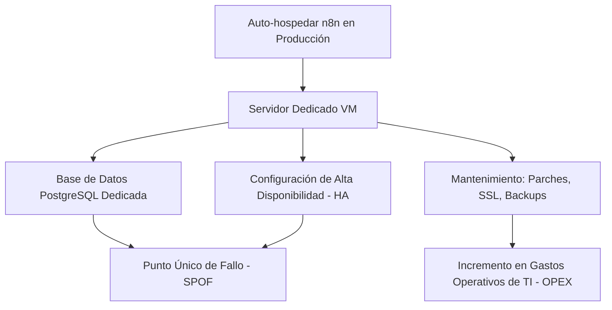
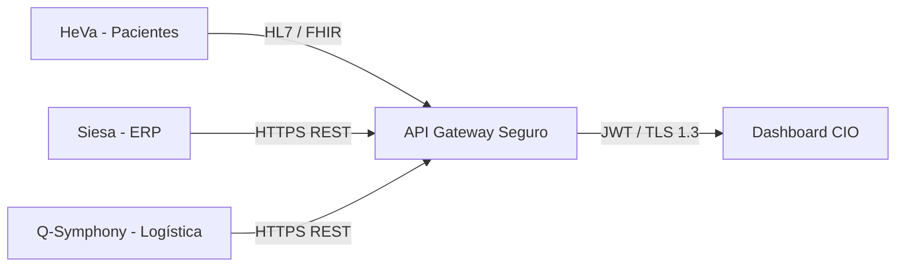

# 5. Análisis Técnico y de Negocio: Exclusión de n8n en Producción

Durante las fases iniciales de diseño del **PETI 2026-2030**, el equipo de TI evaluó la suite de automatización No-Code/Low-Code **n8n** como un posible motor de integración de datos y orquestación de flujos. De hecho, se desarrollaron tres prototipos funcionales de flujos de trabajo localizados en la raíz de este proyecto:

1. **`n8n_workflow.json`**: Un cron semanal que recopilaba métricas de Uptime Robot, Google Sheets (Presupuesto) y Google Forms (CSAT), las consolidaba en un archivo `data.json` y disparaba alertas de SLA vía Gmail.
2. **`n8n_webhook_workflow.json`**: Un webhook que recibía datos de diagnóstico de gobernanza y enviaba por correo electrónico un reporte formateado en HTML.
3. **`n8n_ai_workflow.json`**: Un flujo avanzado que conectaba con la API de Gemini para analizar brechas estratégicas e inyectar métricas evaluadas de forma predictiva.

A pesar del éxito de estos prototipos en entornos de desarrollo y pruebas locales, **la dirección de TI y el CIO de la Cruz Roja Seccional Valle decidieron formalmente no utilizar n8n en el entorno de producción**. 

Este capítulo expone de forma rigurosa los argumentos técnicos, financieros y de cumplimiento que justificaron esta decisión de arquitectura.

---

## 🔒 1. Ciberseguridad y Privacidad de Datos (ISO 27001 y Ley 1581)

El factor decisivo para descartar n8n fue la protección de la información confidencial gestionada por la Cruz Roja Valle:

* **Datos Clínicos Altamente Sensibles**: El Hemocentro procesa historias clínicas, registros de donación de sangre y resultados de tamizaje de enfermedades infecciosas (VIH, Hepatitis B/C, Chagas, Sífilis). Bajo la legislación colombiana (**Ley 1581 de 2012 de Protección de Datos Personales**) y el **MSPI (Modelo de Seguridad y Privacidad de la Información)** de MinTIC, estos datos están clasificados como *Sensibles* y exigen controles de seguridad rigurosos.
* **Vulnerabilidad de Flujos Visuales**: Orquestar flujos de datos médicos mediante nodos visuales en n8n facilita errores de configuración accidental (como la exposición pública de webhooks o almacenamiento temporal de cargas útiles en bases de datos del orquestador).
* **Ausencia de Gobernanza de Acceso Fino (RBAC)**: En su versión de código abierto (Community/Fair-Code), n8n no ofrece control de acceso basado en roles granular para los flujos, auditorías de logs de ejecución detalladas ni cifrado nativo en reposo de las credenciales de conexión a nivel empresarial. Esto representaba un hallazgo crítico de seguridad que impediría a la seccional alcanzar la meta del **90% de cumplimiento ISO 27001** exigida por hospitales y EPS aliadas.

---

## 🛠️ 2. Sobrecarga de Mantenimiento de Infraestructura y SPOF

La sostenibilidad operativa y el control de costes son directrices principales del PETI:

* **Punto Único de Fallo (SPOF)**: Confiar la sincronización en tiempo real del Hemocentro y el Instituto a un único servidor auto-hospedado de n8n crea un cuello de botella crítico. Si el servicio de n8n se detiene, se interrumpe la comunicación entre HeVa, Siesa y Q-Symphony.
* **Sobrecarga para el Equipo de TI**: Configurar un clúster de n8n con alta disponibilidad (HA), escalamiento de contenedores con Docker/Kubernetes, renovación de certificados SSL y políticas de backup inmutables requiere un esfuerzo continuo. El departamento de TI de la Seccional Valle debe concentrarse en el soporte al usuario y la entrega de servicios humanitarios, no en la administración compleja de middleware de integración.
* **Contradicción con el PETI**: Esta sobrecarga administrativa contradice directamente la iniciativa financiera de **reducir el coste operativo de TI** mediante soluciones nativas en la nube simplificadas.

---

## 💰 3. Limitaciones de Licenciamiento y SLA

n8n posee un modelo de licenciamiento particular (*Fair-Code* bajo la licencia `Sustainable Use License`) que restringe ciertos usos corporativos:

* **Restricción Comercial e Institucional**: Aunque la Cruz Roja es una entidad humanitaria sin ánimo de lucro, sus unidades de negocio (Hemocentro e Instituto) compiten y operan comercialmente en el sector salud y educativo. El uso de n8n a gran escala para flujos productivos transaccionales podría exigir la adquisición de licencias empresariales de tipo **n8n Enterprise** o **n8n Cloud Enterprise**.
* **Falta de Garantía de SLA**: La versión gratuita no cuenta con soporte técnico oficial con tiempos de respuesta garantizados (SLA). Ante un fallo crítico de sincronización del hemocomponente en el Hemocentro un sábado a las 2:00 AM, el equipo de TI no dispondría de soporte directo del fabricante, asumiendo un riesgo inaceptable para la continuidad operativa.

---

## ⚡ 4. Rendimiento de Experiencia de Usuario (Zustand vs. n8n)

El **Dashboard Estratégico CIO** cuenta con una consola interactiva de autodiagnóstico diseñada para la simulación prescriptiva inmediata. La experiencia interactiva de esta herramienta habría sido inviable utilizando n8n:

* **Simulación en Tiempo Real (What-If)**: El CIO necesita ajustar deslizadores de calificación de 0 a 5 y ver instantáneamente cómo se actualizan los gráficos de Chart.js, el Uptime, el CSAT y la Directiva de Gobierno.
* **La Latencia de n8n**: Si cada interacción con la interfaz requiriera enviar un payload de webhook a n8n, esperar a que el servidor de n8n ejecute los nodos, llame a la API de Gemini (en el caso de flujos de IA) y devuelva una respuesta HTTP, la latencia mínima oscilaría entre **200 milisegundos y 3 segundos**. Esto rompería la fluidez visual de la aplicación.
* **Independencia de Conexión (Modo Offline)**: Al centralizar la lógica de cálculo matemático directamente en el cliente mediante **Zustand**, el dashboard funciona de forma inmediata y es 100% operativo sin depender de la estabilidad de la red corporativa o el estado de servicios externos de automatización.

---

## 🚀 5. La Alternativa Elegida: Integración Directa y Segura (API Gateway)

En lugar de depender de un orquestador No-Code como n8n en producción, la Cruz Roja Seccional Valle optó por una arquitectura de integración limpia, segura y de nivel empresarial:

### Características de la Arquitectura de Reemplazo

1. **API Gateway Dedicado**: Las conexiones entre **Siesa**, **HeVa** y **Q-Symphony** se manejan directamente a través de un API Gateway seguro, utilizando estándares de comunicación de salud digital internacional como **HL7** y **FHIR**.
2. **Seguridad Robusta End-to-End**: La comunicación se blinda mediante cifrado TLS 1.3, autenticación rígida con JSON Web Tokens (JWT) y políticas estrictas de control de IP (IP Whitelisting).
3. **Microservicios Aislados sin Middleware**: Se elimina la capa intermedia de orquestación visual de n8n, reduciendo los puntos de falla potenciales y facilitando el cumplimiento legal ante auditorías internacionales de **ISO 27001** e **ISO 38500**.
