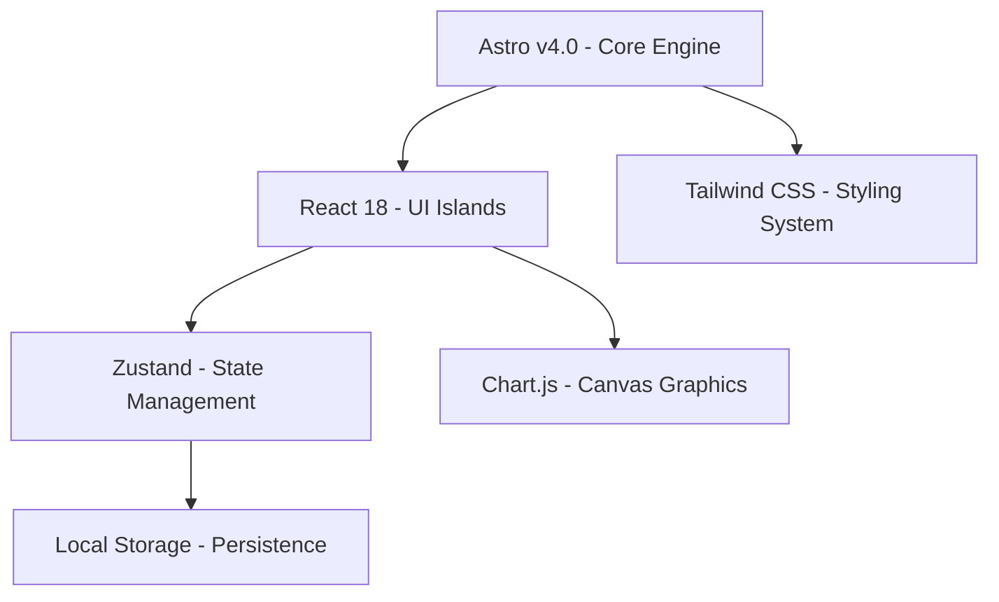

# 2. Arquitectura de Software del Dashboard

El **Dashboard Estratégico CIO** de la Cruz Roja Valle del Cauca está construido siguiendo principios de arquitectura frontend moderna. Prioriza la velocidad de carga, la independencia de servidores backend complejos para la capa analítica de toma de decisiones y un motor reactivo de simulación prescriptiva que responde al instante.

Este capítulo detalla los componentes del stack de software, la gestión del estado y el motor matemático implementado.

---

## 💻 Stack Tecnológico Principal

La solución fue diseñada con tecnologías robustas de alto rendimiento y cero coste de licenciamiento operativo (Convenio Makaia / Licencias Libres):



### 1. Astro (Framework de Integración)
Se utiliza como motor de base para estructurar las rutas y servir el contenido con un rendimiento excepcional. Astro nos permite:
* **Generación Estática (SSG)**: El esqueleto de la aplicación se compila de forma estática en tiempo de compilación (`npm run build`), lo que elimina la necesidad de un servidor web dinámico de Node.js o bases de datos pesadas en producción.
* **Islands Architecture**: El layout base, fuentes y CDNs se cargan de forma puramente estática. Solo las partes interactivas (el dashboard reactivo completo) se hidratan como islas activas de React (`client:load`), logrando un tiempo de carga inicial instantáneo.
* **Optimización SEO Integrada**: Metadata, títulos descriptivos estructurados y etiquetas de accesibilidad optimizados automáticamente para la directiva de la Cruz Roja.

### 2. React (Componentización Interactiva)
La lógica del Cuadro de Mando Integral y la consola de autodiagnóstico están desarrolladas como componentes modulares de React. Esto facilita:
* Reutilización de componentes como tarjetas de KPI, paneles de perspectiva e interruptores de decisiones.
* Renderizado ágil de tablas y gráficos dinámicos en base al estado activo.

### 3. Zustand (Gestión del Estado Ultra-Ligera)
En lugar de implementar frameworks pesados o complejos como Redux o flujos unidireccionales lentos de React Context para toda la lógica, la aplicación utiliza **Zustand**. 
* Zustand provee un almacenamiento centralizado de variables (`useDashboardStore.ts`) accesible desde cualquier subvista del dashboard.
* La persistencia en `LocalStorage` está acoplada nativamente a Zustand, permitiendo que las calificaciones de autodiagnóstico y las decisiones directivas del CIO se mantengan guardadas en el navegador del usuario de forma automática ante recargas de página.

### 4. Tailwind CSS (Sistema de Diseño Estético)
Toda la interfaz visual utiliza clases de utilidad de Tailwind CSS con una paleta de diseño premium "Cyber-Dark" y "Light-Clean", adaptada para lectura ejecutiva:
* **Glow Borders & Glassmorphism**: Paneles semi-translúcidos con bordes brillantes que representan los estados críticos (Rojo Neón), de advertencia (Ámbar) y estables (Verde Esmeralda).
* **Fuentes Premium**: Uso de tipografías legibles como Inter y Outfit para la información administrativa y tipografía monoespaciada para los KPIs ejecutivos.

---

## ⚙️ El Motor de Simulación en Cliente (Derived State)

Uno de los logros arquitectónicos clave de este dashboard es el **Motor de Simulación Integrado** en `useDashboardStore.ts`. En lugar de forzar llamadas API al servidor cada vez que el CIO modifica un puntaje de autodiagnóstico o aprueba un presupuesto, **toda la matemática de interdependencia se calcula en milisegundos en el hilo principal del cliente**.

### Lógica de Dependencias y Cálculo

Cuando se modifica una dimensión (ej. Ciberseguridad), el motor recalcula instantáneamente:
1. **Madurez Digital Promedio**: Promedio simple de las 10 dimensiones ISO 38500.
2. **Presupuesto Consolidado**: Suma acumulada de costes de iniciativas aprobadas.
3. **Uptime del Hemocentro**: 
   $$\text{Uptime} = \min(99.8\%, 98.0\% + (\text{Servidores} \times 0.4\%) + (\text{Backups} \times 0.7\%) + (\text{B2 Azure} \rightarrow 99.8\%))$$
4. **Cumplimiento ISO 27001**: Elevado dinámicamente según control de CISO y conformidad legal.
5. **Cumplimiento de SLA y CSAT**: Métricas resultantes del nivel del sistema de mesa de ayuda.
6. **Estado de Directiva de Gobierno**: Clasificaciones inteligentes como `GOBERNANZA COMPLETA`, `GOBIERNO PARCIAL`, `SOBRE-PRESUPUESTO` o `INCUMPLIMIENTO RIESGO`.

```typescript
// Fragmento del motor de cálculo en cliente
const derived = computeDerivedState(loadedDecs, loadedDiag, loadedAI);
set({ decisions: loadedDecs, diagnosticScores: loadedDiag, ...derived });
```

Esta reactividad inmediata (latencia < 1ms) ofrece una experiencia de usuario sumamente fluida. El CIO puede jugar con escenarios hipotéticos en vivo durante las juntas directivas ("What-If analysis") sin sufrir por retrasos de red o caídas de APIs backend.
