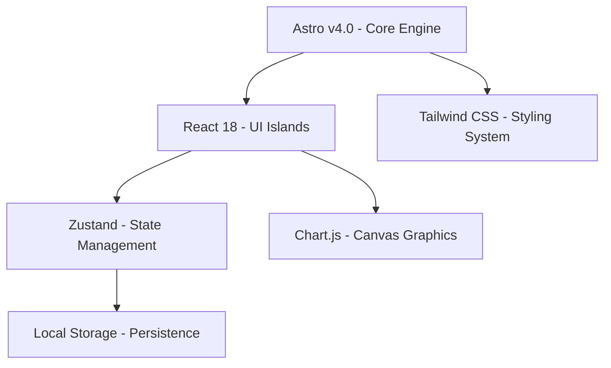

# 2. Arquitectura de Software

El **Dashboard Estratégico CIO** está construido con una arquitectura frontend moderna. Prioriza tres objetivos: carga rápida, operación simple y simulación instantánea.

La solución evita dependencias backend innecesarias en la capa analítica. También responde en tiempo real ante cambios del autodiagnóstico o del presupuesto.

### Accesos rápidos

* **Aplicación en línea:** [cruz-roja-dashboard.vercel.app](https://cruz-roja-dashboard.vercel.app/)
* **Repositorio:** [github.com/jevg2003/cruz-roja-dashboard](https://github.com/jevg2003/cruz-roja-dashboard)

<figure><figcaption><p>Vista general del dashboard ejecutivo.</p></figcaption></figure>


La arquitectura está pensada para soportar análisis ejecutivo en vivo. El sistema calcula escenarios sin depender de APIs de backend para cada interacción.


### Arquitectura en una mirada



#### Principios de diseño

* **Rendimiento primero** para abrir rápido y responder al instante.
* **Frontend autónomo** para reducir complejidad operativa.
* **Estado reactivo** para simular decisiones en tiempo real.



#### Resultado para la dirección

* Menor latencia en sesiones de comité.
* Menor coste operativo en producción.
* Mayor claridad para evaluar escenarios `what-if`.



### Stack tecnológico principal

La solución combina herramientas de alto rendimiento y bajo coste operativo. Esto encaja con el convenio Makaia y el enfoque de licencias libres.





#### Astro como motor base

Astro estructura rutas y entrega contenido con alto rendimiento.

* **SSG** compila el esqueleto en `build`.
* **Islands Architecture** hidrata solo la parte interactiva.
* **SEO y accesibilidad** quedan integrados desde la base.



#### React para la capa interactiva

El Cuadro de Mando Integral y la consola de autodiagnóstico viven en componentes modulares.

* Reutiliza tarjetas de KPI y paneles ejecutivos.
* Renderiza tablas y gráficos según el estado activo.



#### Zustand para el estado global

Zustand centraliza la lógica en `useDashboardStore.ts`.

* Expone el estado a cualquier subvista.
* Persiste decisiones y calificaciones en `LocalStorage`.
* Evita la sobrecarga de soluciones más pesadas.



#### Tailwind CSS para el sistema visual

La interfaz usa una estética ejecutiva y contemporánea.

* Paneles con efecto visual tipo `glassmorphism`.
* Bordes de estado para criticidad, alerta y estabilidad.
* Tipografías legibles para lectura directiva.



### Motor de simulación en cliente

Uno de los componentes más valiosos del dashboard es el motor de simulación integrado en `useDashboardStore.ts`.

Cada cambio se procesa en el navegador. No necesita una llamada al servidor para recalcular resultados.

#### Qué recalcula al instante

Cuando cambia una dimensión, como Ciberseguridad, el sistema actualiza de inmediato:

1. **Madurez digital promedio** de las 10 dimensiones ISO 38500.
2. **Presupuesto consolidado** de las iniciativas aprobadas.
3. **Uptime del Hemocentro** con base en infraestructura y backups.
4. **Cumplimiento ISO 27001** según controles y conformidad.
5. **SLA y CSAT** según la madurez de la mesa de ayuda.
6. **Estado de gobierno** con salidas como `GOBERNANZA COMPLETA` o `INCUMPLIMIENTO RIESGO`.

#### Fórmula clave de disponibilidad

$$
\text{Uptime} = \min(99.8\%, 98.0\% + (\text{Servidores} \times 0.4\%) + (\text{Backups} \times 0.7\%) + (\text{B2 Azure} \rightarrow 99.8\%))
$$


```typescript
// Fragmento del motor de cálculo en cliente
const derived = computeDerivedState(loadedDecs, loadedDiag, loadedAI);
set({ decisions: loadedDecs, diagnosticScores: loadedDiag, ...derived });
```



La latencia es menor a 1 ms. Esto permite simular decisiones en vivo durante juntas directivas.


### Impacto operativo

Esta arquitectura permite que el CIO pruebe escenarios sin fricción.

* Ajusta puntajes y presupuestos en tiempo real.
* Visualiza consecuencias sin esperar respuestas de red.
* Reduce el riesgo de interrupciones por servicios externos.
