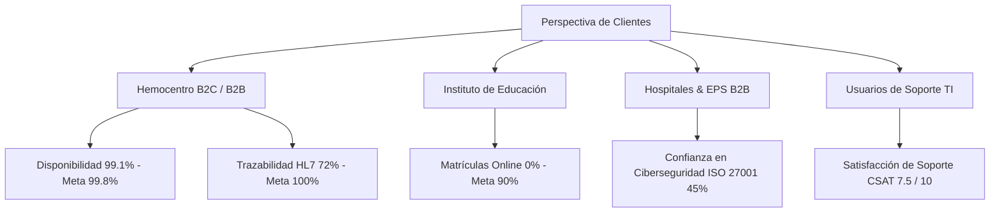

# 4. Cuadro de Mando Integral (Balanced Scorecard)

El **Cuadro de Mando Integral (Balanced Scorecard - BSC)** es la metodología estratégica que traduce la misión de la **Cruz Roja Seccional Valle del Cauca** en un conjunto de indicadores medibles y proyectos concretos. A diferencia de las corporaciones puramente comerciales, el éxito financiero en la Cruz Roja es un habilitador directo para cumplir el objetivo humanitario.

Este capítulo describe en detalle el funcionamiento de las **4 Perspectivas** implementadas en nuestro dashboard, sus indicadores clave de rendimiento (KPIs) y su interconexión lógica.

---

## 📈 1. Perspectiva Financiera: Sostenibilidad e Inversión

El pilar financiero asegura la sostenibilidad a largo plazo de las misiones humanitarias. La Seccional Valle del Cauca gestiona sus finanzas con un enfoque riguroso de control de gastos y aprovechamiento de convenios de bajo coste:

* **Ingresos Totales (2024)**: **$1.240M COP**. El modelo comercial social se distribuye de la siguiente manera:
  * **Hemocentro Seccional**: Genera el **62%** ($771M COP) de los ingresos.
  * **Educación (Instituto)**: Genera el **5%** ($61M COP).
  * **Lotería, Donaciones y Otros**: Generan el **33%** restante.
* **Ejecución Presupuestal de TI**: Monitorea que la desviación del presupuesto de **$330M COP** del PETI 2026-2030 no supere el 10% anual.
* **Ahorro Makaia (Licencias Microsoft 365)**: Se cuenta con un convenio activo bajo el programa *Nonprofit* que otorga **646 licencias gratuitas de Microsoft 365**, liberando presupuesto administrativo para destinarlo a proyectos de infraestructura crítica.
* **Activos Tecnológicos (Valor Histórico)**: Evaluados en **$321M COP**. Gran parte del hardware físico en el datacenter local supera los 5 años de antigüedad, considerándose en riesgo operativo inminente.

---

## 👥 2. Perspectiva de Clientes y Comunidad

Esta perspectiva evalúa la calidad, confianza y digitalización percibida por nuestros principales usuarios externos e internos:

### A. Hemocentro (Servicio Crítico 24/7)
* **Disponibilidad de Servicios**: Actualmente en **99.1%** (Meta: 99.8%). Cada 0.1% de caída por debajo de la meta representa pérdidas de confianza y recursos vitales.
* **Trazabilidad de Hemocomponentes**: En **72%** (Meta: 100%). Se busca integrar mediante APIs el flujo del hemocomponente desde la donación hasta el despacho hospitalario.
* **Predicción de Donación (HemoAI Analytics)**: Implementación de la solución de Machine Learning predictivo **HemoAI Analytics** para prever patrones de abastecimiento. Al clasificar como sistema de *Alto Riesgo* bajo el EU AI Act, se rige por las directivas éticas de la norma **ISO 42001:2023** y el monitoreo de desvío de datos (**Drift PSI**).
* **Trámites Digitales**: Solo el **30%** de trámites y agendamientos son digitales. La meta para 2030 es alcanzar el **90%** mediante el proyecto de Portal Transaccional PSE.

### B. Instituto de Educación
* **Progreso de Digitalización**: Actualmente en **0% (Falla / Riesgo Alto)**. El Instituto se encuentra bajo amenaza por sustitutos EdTech gratuitos. Requiere la activación urgente de un portal educativo con pasarela de pago PSE.

### C. EPS y Hospitales Aliados (B2B)
* **Nivel de Confianza en Ciberseguridad**: Actualmente en **70%** (Meta: 85%). Los hospitales aliados exigen altos estándares de protección de datos clínicos para interoperar. El cumplimiento del estándar **ISO 27001** (hoy en 45%) es clave para sostener esta confianza.

### D. Gestión de Soporte de TI Interno
* **CSAT Global**: Actualmente en **7.5 / 10** (Meta: 9.0).
* **Tickets Resueltos en SLA**: En **80%** (Meta: 90%).
* **Confianza Digital del Personal**: En **70%** (Meta: 90%).

---

## ⚙️ 3. Perspectiva de Procesos Internos

Representa la eficiencia y seguridad de las operaciones internas de TI, identificando vulnerabilidades críticas:

### KPIs Operativos de TI
* **Cumplimiento ISO 27001**: Actualmente en **45%** (Meta: 70% en 2026). Denota una exposición severa a ciberamenazas.
* **Cumplimiento RTO/RPO de Desastres (DRP)**: En **40%**. No se cuenta con backups inmutables probados periódicamente.
* **Integración de Sistemas**: En **0% (Islas)**. Siesa, HeVa y Q-Symphony operan aislados, forzando transcripciones manuales propensas a errores.
* **Cumplimiento SLA de Mesa de Ayuda**: En **75%** (Meta: 95%).

### Radar de Amenazas (Matriz FODA de Procesos)
El sistema pondera 6 amenazas organizacionales basadas en su probabilidad e impacto:
1. **Ransomware (25% Importancia - CRÍTICO)**: Sin CISO ni SOC, la Cruz Roja Valle es vulnerable a cifrados de base de datos que paralizarían el Hemocentro.
2. **Servidores Físicos Obsoletos (20% Importancia - CRÍTICO)**: Servidores locales con más de 5 años de servicio sin plan de contingencia física.
3. **Sanciones Ley 1581 (15% Importancia - ALTO)**: Posibles multas por la Superintendencia ante fallas de seguridad en datos de donantes y alumnos.
4. **Desintermediación Educativa (15% Importancia - MEDIO)**: Pérdida del mercado educativo del Instituto B2C por carecer de pasarela de pago.
5. **Dependencia de Proveedores (15% Importancia - MEDIO)**: Alto lock-in tecnológico de HeVa y Siesa.
6. **Ausencia de Líder de Seguridad (10% Importancia - ALTO)**: Falta de un rol formal CISO que centralice las directivas de protección.

---

## 🎓 4. Perspectiva de Aprendizaje y Crecimiento

Mide las capacidades humanas y organizacionales que soportan todo el sistema de TI de la Seccional:

* **Madurez Digital del Personal**: Evaluada en **2.8 / 5.0 (Brecha Crítica)**. Denota alta resistencia al cambio y escasa apropiación de herramientas digitales corporativas.
* **Personal Certificado**: El **70%** del equipo de TI cuenta con certificaciones básicas. La meta es alcanzar un **95%** en ITIL 4 Avanzado y COBIT 2019 mediante un presupuesto de $15M COP.
* **Prácticas COBIT**: En **40% (Inicial)**. Se requiere formalizar manuales, rutas de carrera de TI y documentación centralizada en SharePoint.
* **Roadmap del PETI**: Seguimiento dinámico de cronogramas para los proyectos activos (B7, B1, B8, B2, B3, B5), garantizando que las iniciativas de capacitación digital precedan o acompañen los despliegues de software complejo.
