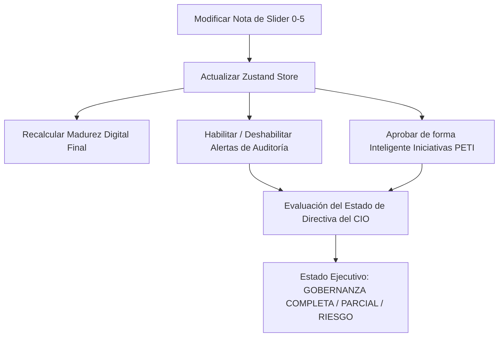

# 3. Autodiagnóstico de Gobernanza (ISO/IEC 38500)

La toma de decisiones tecnológicas informadas requiere conocer el punto de partida real. En el **Dashboard Estratégico CIO**, esto se materializa mediante la **Consola de Autodiagnóstico de Gobernanza TI**, un motor evaluativo estructurado en base a las mejores prácticas internacionales de la norma **ISO/IEC 38500** y el marco de gobernanza **COBIT 2019**.

Este capítulo profundiza en las 10 dimensiones de evaluación implementadas, los niveles de madurez digital y el mecanismo de actualización automática en cascada.

---

## 📐 Las 10 Dimensiones de Evaluación

El CIO de la Seccional Valle califica periódicamente 10 aspectos neurálgicos de la gobernanza interna. Cada dimensión influye en cascada sobre las métricas operativas del Balanced Scorecard:

| # | Dimensión de TI | Estándar / Regulador | Impacto Estratégico en la Seccional |
| :--- | :--- | :--- | :--- |
| **1** | **Gobernanza Ciberseguridad (CISO)** | ISO 27001 / COBIT | Evalúa la existencia de roles dedicados a ciberseguridad. Si la nota es baja, eleva el riesgo de Ransomware. |
| **2** | **Protección de Datos (Ley 1581)** | MinTIC / Superintendencia | Cumplimiento legal del tratamiento de datos personales de donantes, alumnos y voluntarios. Evita multas. |
| **3** | **Servidores de Captación** | Continuidad Operativa | Estado físico del centro de datos local del Hemocentro. Afecta directamente la disponibilidad de HeVa. |
| **4** | **Continuidad de Negocio (DRP)** | ISO 22301 / DRP Cloud | Calidad y periodicidad de restauración de copias de seguridad. Determina la velocidad ante desastres. |
| **5** | **Interoperabilidad API Gateway** | Estándares HL7 / FHIR | Nivel de integración de sistemas médicos (HeVa), contables (Siesa) y logísticos (Q-Symphony). |
| **6** | **Canales de Donantes** | Transformación Digital | Existencia de app y portales interactivos de donación. Habilita nuevos canales en el Hemocentro. |
| **7** | **Portal Educativo** | EdTech Institucional | Capacidad de autogestión de matrículas y pagos online PSE en el Instituto de Educación Seccional. |
| **8** | **Apropiación Digital** | Gestión del Cambio | Brecha digital interna. Nivel de uso y resistencia tecnológica de los voluntarios y personal de campo. |
| **9** | **Mesa de Ayuda** | ITIL v4 / Niveles de SLA | Eficiencia de la gestión de incidencias internas de TI. Determina el CSAT y la satisfacción del usuario. |
| **10** | **Convenios Makaia** | Optimización Financiera | Renovación y aprovechamiento del licenciamiento gratuito de Microsoft 365 Nonprofit para el ahorro operativo. |

---

## 📶 Escala de Niveles de Madurez Digital (0 - 5.0)

La escala utilizada se basa en el modelo clásico de madurez de procesos de COBIT (CMMI):

* **Maturity 0 - 1.0 (Inicial / Ad-Hoc)**:  
  Procesos caóticos. No hay roles definidos, la ciberseguridad es inexistente y las paradas de servicio se resuelven de forma puramente reactiva.
* **Maturity 2.0 (Repetible pero Informal)**:  
  Los procesos se realizan siguiendo patrones básicos, pero dependen del conocimiento de personas específicas. Sin documentación formal ni DRP activo.
* **Maturity 3.0 (Proceso Definido)**:  
  Procesos documentados, estandarizados e integrados en la cultura de la Cruz Roja. Se cuenta con un rol responsable directo del área.
* **Maturity 4.0 (Administrado y Medible)**:  
  Los procesos operan con métricas de SLA claras. Se utilizan sistemas de monitoreo y alertas automáticas.
* **Maturity 5.0 (Optimizado / Excelente)**:  
  Automatización avanzada (ej. integraciones API directas), auditorías de seguridad constantes, ciberdefensa proactiva y alineación estratégica perfecta.

---

## ⚡ El Mecanismo de Cascada Automática

En la consola de autodiagnóstico (`QuestionsGrid.tsx`), al alterar un puntaje del slider (0-5), el estado del dashboard no solo guarda una calificación promedio, sino que **desencadena una reclasificación en cadena en la matriz de Gobernanza (ISO 38500)**:

### 1. Actualización Automática de Auditorías (Evaluar)
Si una dimensión estratégica cae por debajo de la línea aceptable ($\le 3.0$), el sistema activa automáticamente una auditoría de contingencia para forzar a la directiva a "Evaluar" el riesgo:
* Nota en Servidores $\le 3 \rightarrow$ **Auditoría de Servidores Activa**.
* Nota en Responsabilidad o Conformidad $\le 3 \rightarrow$ **Auditoría de Seguridad Activa**.
* Nota en Apropiación o Mesa de Ayuda $\le 3 \rightarrow$ **Auditoría de Procesos Activa**.

### 2. Aprobación Automática de Proyectos (Dirigir)
Por el contrario, cuando los puntajes de la consola demuestran un nivel operativo superior ($\ge 3.0$ o $\ge 4.0$), el motor asume que la organización ha progresado y aprueba automáticamente los proyectos de inversión del PETI correspondientes:
* Responsabilidad y Conformidad $\ge 3 \rightarrow$ **Proyecto CISO Aprobado (B1)**.
* Servidores y Backups $\ge 3 \rightarrow$ **Proyecto Azure Cloud Aprobado (B2)**.
* Interoperabilidad $\ge 3 \rightarrow$ **Proyecto API Gateway Aprobado (B3)**.
* Canales Donantes y Portal $\ge 3 \rightarrow$ **Proyecto Hemocentro 4.0 y Portal Aprobados (B5)**.
* Interoperabilidad $\ge 4 \rightarrow$ **Proyecto Gobierno de Datos Aprobado (B7)**.
* Apropiación Digital $\ge 3 \rightarrow$ **Proyecto Capacitación Voluntarios Aprobado (B8)**.

Este comportamiento imita las decisiones lógicas de un Director de TI de primer nivel, ilustrando perfectamente cómo un aumento en la madurez y la inversión disminuye la exposición legal y de ciberseguridad corporativa.
