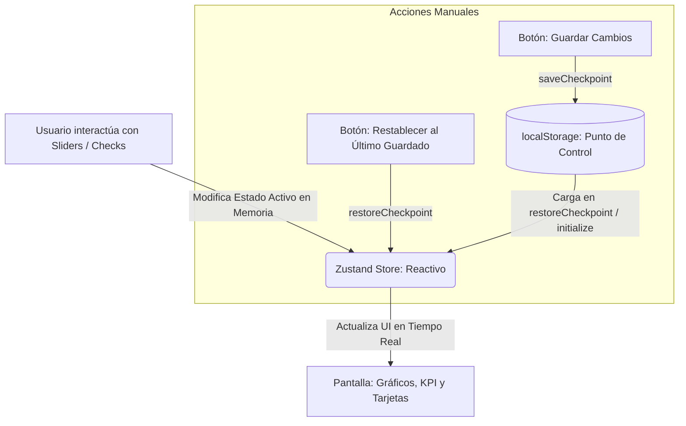

# 7. Sistema de Guardado Manual, Puntos de Control y Niveles de Madurez Dinámicos

Esta sección describe la arquitectura técnica, las decisiones de diseño y las mejoras del sistema de **Guardado Manual, Puntos de Control (Checkpoints)** y la lógica de **Niveles de Madurez Dinámicos** implementada en el Dashboard Estratégico CIO.

---

## 🎯 Propósito y Justificación de Negocio

En la gestión de Gobierno de TI, Datos e IA para la Cruz Roja, es crucial que los directores de TI puedan **realizar simulaciones en tiempo real** (p. ej. "¿Qué pasa si mejoramos la calidad de datos al 90%?").

Anteriormente, el dashboard guardaba de forma automática cada cambio en el navegador, lo que provocaba:
1.  **Imposibilidad de Experimentar:** Cualquier movimiento accidental de un slider sobrescribía la línea base oficial cargada.
2.  **Riesgo de Pérdida de Datos:** El usuario no tenía control sobre cuándo consolidar formalmente su evaluación corporativa.

### La Solución Implementada:
Diseñamos un **Flujo de Trabajo Corporativo Seguro** compuesto por:
*   **Simulaciones en Memoria:** Los cambios de sliders e hitos se computan y renderizan en la interfaz reactivamente al instante, pero permanecen en memoria temporal.
*   **Punto de Control (Save Checkpoint):** Un botón formal al final del dashboard consolida la evaluación en el almacenamiento persistente (`localStorage`).
*   **Restablecimiento (Restore Checkpoint):** Un botón al inicio del dashboard permite revertir cualquier cambio de simulación al último punto de control guardado por el usuario, protegiendo los datos oficiales de errores accidentales.

---

## ⚙️ Arquitectura Técnica en Zustand (`useDashboardStore.ts`)

Para soportar este flujo sin añadir latencias de renderizado, modificamos el motor de estado del almacén Zustand:



### 1. Desacoplamiento del Autoguardado
Eliminamos las llamadas persistentes inmediatas en las acciones de actualización (`updateScore`, `updateDecision`, `updateDataGov`, `updateAIGov`). Ahora estas funciones operan de manera puramente reactiva en memoria, liberando de operaciones de escritura constantes al navegador:

```typescript
// Ejemplo de acción reactiva pura en memoria en Zustand
updateScore: (key, score) => {
  const { diagnosticScores, decisions, dataGov, aiGov } = get();
  const nextScores = { ...diagnosticScores, [key]: score };
  const nextData = { ...dataGov };
  
  // Sincronizaciones D1 <-> D2 en memoria...
  nextData.dataMaturity = parseFloat(computeDataMaturity(...));
  nextData.dataMaturityLevel = getMaturityLevelName(nextData.dataMaturity);

  const derived = computeDerivedState(nextDecs, nextScores, nextData.dataMaturity, nextAI.aiMaturity);

  set({
    diagnosticScores: nextScores,
    dataGov: nextData,
    ...derived,
  });
}
```

### 2. Implementación de la Lógica de Checkpoints

Añadimos las siguientes acciones clave al almacén:

*   **`saveCheckpoint`**: Captura el estado activo de diagnósticos, decisiones corporativas, gobierno de datos e IA y los escribe de forma atómica en formato JSON estructurado:
    ```typescript
    saveCheckpoint: () => {
      const { decisions, diagnosticScores, dataGov, aiGov } = get();
      if (typeof window !== 'undefined') {
        localStorage.setItem('cruz_roja_decisions', JSON.stringify(decisions));
        localStorage.setItem('cruz_roja_diagnostic', JSON.stringify(diagnosticScores));
        localStorage.setItem('cruz_roja_datagov', JSON.stringify(dataGov));
        localStorage.setItem('cruz_roja_aigov', JSON.stringify(aiGov));
      }
    }
    ```
*   **`restoreCheckpoint`**: Carga el JSON de `localStorage` y actualiza todos los sub-estados y variables derivadas de manera simultánea en el almacén:
    ```typescript
    restoreCheckpoint: () => {
      if (typeof window === 'undefined') return;
      const savedDecs = localStorage.getItem('cruz_roja_decisions');
      // ... Carga y parsea de forma segura ...
      const { nextData, nextAI } = syncGobernanzaWithDecisions(loadedDecs, loadedData, loadedAI);
      const derived = computeDerivedState(loadedDecs, loadedDiag, nextData.dataMaturity, nextAI.aiMaturity);

      set({
        decisions: loadedDecs,
        diagnosticScores: loadedDiag,
        dataGov: nextData,
        aiGov: nextAI,
        ...derived,
      });
    }
    ```

---

## 📈 Algoritmo Dinámico de Niveles de Madurez

El mapeo de madurez de la Seccional se rige por un motor matemático que traduce el puntaje continuo de `0.0` a `5.0` en escalas textuales de auditoría oficial de la línea base:

$$\text{Nivel Calculado} = f(\text{Puntaje}) \longrightarrow \begin{cases} 
      0.0 \le x \le 1.0 & \text{Nivel 0: Inexistente} \\
      1.1 \le x \le 2.0 & \text{Nivel 1: Inicial} \\
      2.1 \le x \le 3.0 & \text{Nivel 2: Reactivo} \\
      3.1 \le x \le 4.0 & \text{Nivel 3: Definido} \\
      4.1 \le x \le 4.9 & \text{Nivel 4: Medible} \\
      5.0 & \text{Nivel 5: Optimizado} 
   \end{cases}$$

Esta función se declara globalmente y se integra en el cálculo del estado en tiempo real:

```typescript
export const getMaturityLevelName = (score: number): string => {
  if (score <= 1.0) return 'Nivel 0: Inexistente';
  if (score <= 2.0) return 'Nivel 1: Inicial';
  if (score <= 3.0) return 'Nivel 2: Reactivo';
  if (score <= 4.0) return 'Nivel 3: Definido';
  if (score < 5.0) return 'Nivel 4: Medible';
  return 'Nivel 5: Optimizado';
};
```

---

## 🎨 Innovaciones en el Diseño de Interfaz (`IntegralDashboardView.tsx`)

Alineado con las directrices visuales del marco **UI/UX Pro Max** y la identidad corporativa de Cruz Roja, realizamos tres ajustes estéticos de alto nivel:

### 1. Reubicación Visual ("Abajo del Puntaje")
Para evitar la saturación visual, quitamos las etiquetas horizontales al lado de los valores numéricos. 
*   El puntaje numérico creció a un tamaño destacado de `3xl` con tipografía ejecutiva.
*   Las insignias de madurez se situaron **abajo**, en un bloque vertical que agrupa la insignia en color de contraste con tipografía `font-mono` y bordes finos de color (`bg-red-50 text-brand-red border-red-200` para TI, `bg-cyan-50 text-cyan-600 border-cyan-200` para Datos, y `bg-purple-50 text-purple-600 border-purple-200` para IA), dándole un balance extraordinario a cada tarjeta.

### 2. Barra de Acciones Superior (Top Action Strip)
Insertamos una barra glassmorphic flotante justo al inicio de la cuadrícula de KPIs que le indica al usuario el estado de la simulación e integra el botón de restablecer con micro-animaciones en escala:
```html
<button onClick={restoreCheckpoint} className="flex items-center gap-2 text-xs font-black text-slate-700 bg-white border border-slate-300 hover:bg-slate-50 px-4.5 py-2.5 rounded-xl transition-all">
  <i className="fa-solid fa-arrow-rotate-left"></i>
  Restablecer al Último Guardado
</button>
```

### 3. Banner de Guardado Final (Bottom Save Banner)
Al final de la página, implementamos una sección de llamado a la acción (CTA) con un fondo degradado de escala de oscuros y bordes glassmorphic que contiene el botón destacado **Guardar Cambios**, dotado de retroalimentación inmediata mediante Toasts de confirmación exitosa.

---

> [!NOTE]
> Todos los datos iniciales expuestos en el repositorio de modelos de referencia coinciden exactamente con la línea base de la Seccional (Maturity TI = 2.8, Datos = 2.4, IA = 1.8), garantizando la veracidad académica de la aplicación.
