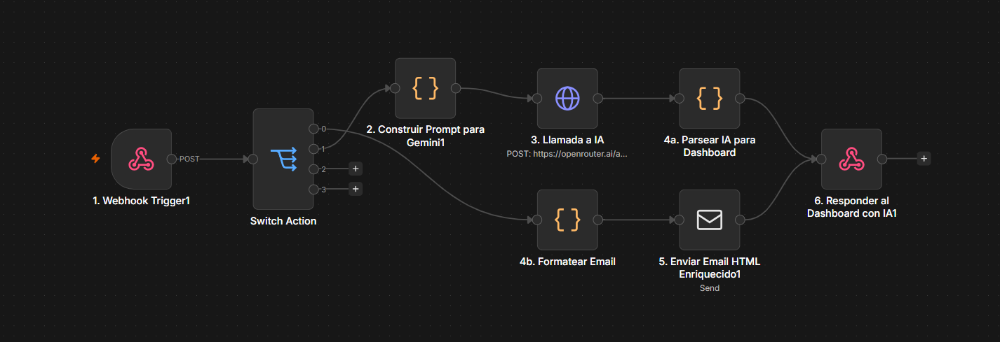
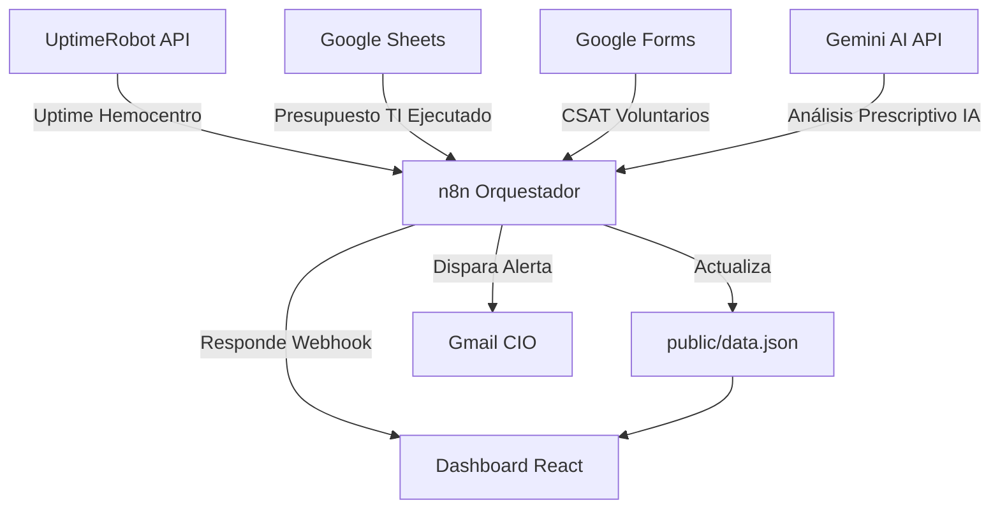
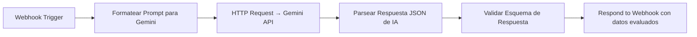

# 5. Integración con n8n

El **Dashboard Estratégico CIO** de la Cruz Roja Seccional Valle del Cauca integra **n8n** como motor de automatización y orquestación de flujos de trabajo. n8n es una plataforma de automatización de código abierto (Fair-Code) que permite conectar servicios externos, ejecutar lógica condicional y disparar alertas inteligentes sin necesidad de desarrollar APIs backend complejas desde cero.

En este proyecto, n8n cumple el rol de **capa de integración entre las fuentes de datos institucionales y el Cuadro de Mando Integral (BSC)**, garantizando que los indicadores del dashboard reflejen información actualizada de forma automática y oportuna.

Url: [https://jevg2003.app.n8n.cloud/workflow/oHPuASPRK4Z0JHoV](https://jevg2003.app.n8n.cloud/workflow/oHPuASPRK4Z0JHoV)

<figure><figcaption></figcaption></figure>

***

## 🏗️ Arquitectura de Integración con n8n

Los flujos de n8n actúan como el puente entre las fuentes de datos externas (UptimeRobot, Google Sheets, Google Forms y la API de Gemini) y el dashboard estático desplegado:



***

## 📂 Flujos de Trabajo Implementados

Se desarrollaron tres flujos de n8n, cada uno con un propósito estratégico diferente dentro del sistema de gobernanza:

***

### 1. `n8n_workflow.json` — Actualización Automática Semanal del BSC

**Propósito:** Este flujo corre automáticamente **cada lunes a las 8:00 AM** mediante un nodo Cron. Recopila los indicadores clave del periodo y actualiza el archivo `public/data.json` del dashboard.

**Nodos del flujo:**

| Nodo                                    | Tipo          | Función                                                                     |
| --------------------------------------- | ------------- | --------------------------------------------------------------------------- |
| `Cron (Cada Lunes 8:00 AM)`             | Trigger       | Dispara el flujo semanalmente.                                              |
| `Fetch Uptime (Hemocentro API)`         | HTTP Request  | Consulta la disponibilidad del Hemocentro vía UptimeRobot.                  |
| `Fetch Presupuesto TI (Google Sheets)`  | Google Sheets | Lee el porcentaje de ejecución presupuestal del PETI.                       |
| `Fetch CSAT Voluntarios (Google Forms)` | Google Sheets | Lee la puntuación de satisfacción de soporte de la última semana.           |
| `Read current data.json`                | File          | Lee el archivo JSON actual del dashboard para fusionar los datos nuevos.    |
| `Transform & Merge (BSC TI Logic)`      | Code (JS)     | Fusiona y transforma los datos en el esquema del Balanced Scorecard.        |
| `Write to data.json`                    | File          | Escribe el JSON actualizado de vuelta al directorio `public/` del proyecto. |
| `Check SLA Breach (Uptime < 99.5%)`     | IF            | Evalúa si el uptime del Hemocentro cayó por debajo del límite estratégico.  |
| `Alert Gmail (CIO Valle)`               | Gmail         | Envía una alerta urgente al Director de TI si se detecta una caída crítica. |

**Fragmento del nodo de transformación:**

```javascript
// Fusionar los datos capturados y formatearlos para el BSC
const uptimeData = $items("Fetch Uptime (Hemocentro API)")[0]?.json?.monitors?.[0]
  || { custom_uptime_ratio: "99.1" };

const presupuestoData = $items("Fetch Presupuesto TI (Google Sheets)")[0]?.json
  || { porcentaje_ejecutado: 67 };

// Actualizar en vivo las métricas dinámicas
currentData.top_kpis.disponibilidad_hemocentro.value = parseFloat(uptimeData.custom_uptime_ratio);
currentData.top_kpis.ejecucion_presupuesto.value = parseInt(presupuestoData.porcentaje_ejecutado);
currentData.last_updated = new Date().toISOString();
```

***

### 2. `n8n_webhook_workflow.json` — Envío Automático de Reportes Ejecutivos por Correo

**Propósito:** Este flujo expone un **webhook HTTP** que el dashboard activa cuando el CIO solicita un reporte formal. Recibe el diagnóstico de gobernanza completo y envía un correo HTML profesional al directivo indicado.

**Nodos del flujo:**

| Nodo                 | Tipo           | Función                                                                |
| -------------------- | -------------- | ---------------------------------------------------------------------- |
| `Webhook Trigger`    | Webhook (POST) | Recibe el payload de diagnóstico desde el Dashboard React.             |
| `Send Email Report`  | Email          | Genera y envía el reporte ejecutivo en HTML al correo configurado.     |
| `Respond to Webhook` | Respond        | Devuelve una respuesta JSON confirmando el envío y el ID de ejecución. |

**Endpoint del webhook:**

```
POST https://[tu-instancia-n8n]/webhook/cruz-roja-diagnostico
```

**Payload enviado desde el Dashboard:**

```json
{
  "email": "director.ti.valle@cruzroja.org.co",
  "computed_maturity": 2.8,
  "conformance_status": "GOBIERNO PARCIAL",
  "estimated_investment_required": "$330M COP",
  "iso_38500_scores": {
    "responsabilidad": 2,
    "conformidad": 2,
    "servidores": 2
  }
}
```

El correo generado incluye una tabla de resultados ISO 38500 por dimensión, el estado de madurez digital, el presupuesto PETI estimado y el plan de mitigación de riesgos inmediato.

***

### 3. `n8n_ai_workflow.json` — Análisis Prescriptivo con Inteligencia Artificial (Gemini)

**Propósito:** El flujo más avanzado del sistema. Conecta el diagnóstico de gobernanza con la **API de Google Gemini** para generar una evaluación prescriptiva enriquecida con inteligencia artificial. Los resultados son inyectados de regreso al dashboard como métricas evaluadas por IA.

**Arquitectura del flujo:**



**Métricas que Gemini evalúa y devuelve al dashboard:**

| Campo evaluado por IA                | Descripción                                                                 |
| ------------------------------------ | --------------------------------------------------------------------------- |
| `madurez_digital_evaluada`           | Puntuación de madurez ajustada por IA según el contexto humanitario.        |
| `iso_27001_evaluado`                 | Nivel de cumplimiento estimado con base en las respuestas del diagnóstico.  |
| `disponibilidad_hemocentro_evaluado` | Predicción de disponibilidad según el estado de infraestructura actual.     |
| `ejecucion_presupuesto_evaluado`     | Porcentaje de presupuesto ejecutado recomendado para la fase actual.        |
| `ingresos_hemocentro_evaluado`       | Estimación de ingresos del Hemocentro según nivel de riesgo operativo.      |
| `resumen_ejecutivo`                  | Análisis textual de brechas y recomendaciones generado por el modelo de IA. |

Cuando el análisis de IA está activo, el header del dashboard muestra:

```
Sincronizado con IA: Activo (Real-time)
```

***

## 🔗 Integración con el Dashboard React

El Dashboard lee y utiliza los datos de n8n de dos formas:

### 1. Datos estáticos actualizados (`public/data.json`)

El flujo semanal Cron escribe directamente el archivo `public/data.json`. Al cargar la página, el dashboard consume este archivo para poblar todos los indicadores del BSC con la información más reciente.

### 2. Respuesta en tiempo real del webhook (análisis IA)

Cuando el CIO activa el análisis de IA desde la consola, el dashboard envía un `POST` al webhook de n8n y recibe la respuesta JSON. El store de Zustand (`useDashboardStore.ts`) actualiza el estado con la función `setAiResponse()`:

```typescript
// El dashboard aplica las métricas evaluadas por IA como overrides
if (aiAnalysis) {
  if (aiAnalysis.madurez_digital_evaluada !== undefined) {
    digitalMaturityFinal = parseFloat(aiAnalysis.madurez_digital_evaluada.toFixed(1));
  }
  if (aiAnalysis.iso_27001_evaluado !== undefined) {
    iso27001Final = aiAnalysis.iso_27001_evaluado;
  }
}
```

Los resultados quedan almacenados en `localStorage` bajo la clave `cruz_roja_ai_evaluated_data`, permitiendo persistencia entre sesiones sin necesidad de re-ejecutar el flujo.

***

## ⚙️ Configuración y Despliegue de n8n

Para replicar esta integración en un nuevo entorno, n8n puede desplegarse de las siguientes formas:

### Opción A — n8n Cloud (Recomendado para inicio rápido)

1. Crear una cuenta en [https://app.n8n.cloud](https://app.n8n.cloud)
2. Importar los archivos `.json` desde **"Import from file"** en la interfaz de n8n.
3. Configurar las credenciales de Gmail, Google Sheets y UptimeRobot en el panel de credenciales.
4. Activar los flujos con el toggle **"Active"**.

### Opción B — Auto-hospedado con Docker

```bash
docker run -it --rm \
  --name n8n \
  -p 5678:5678 \
  -v ~/.n8n:/home/node/.n8n \
  n8nio/n8n
```

Luego acceder a `http://localhost:5678` e importar los tres archivos `.json`.

***

## 📧 Ejemplo de Alerta Automática Enviada por n8n

Cuando el Hemocentro cae por debajo del **99.5% de disponibilidad**, n8n envía automáticamente el siguiente correo al CIO:

> **Asunto:** ⚠️ ALERTA GOBIERNO DE TI: Caída de Disponibilidad en Hemocentro
>
> Estimado CIO,
>
> El flujo de n8n ha detectado que la disponibilidad del Hemocentro es de **99.1%**, lo cual es inferior al límite estratégico del 99.5%.
>
> **Prescripción inmediata sugerida:** Migrar base de datos HeVa a la infraestructura Cloud Híbrida de Azure y contactar al proveedor de contingencia.
>
> — Dashboard Estratégico CIO Valle.
