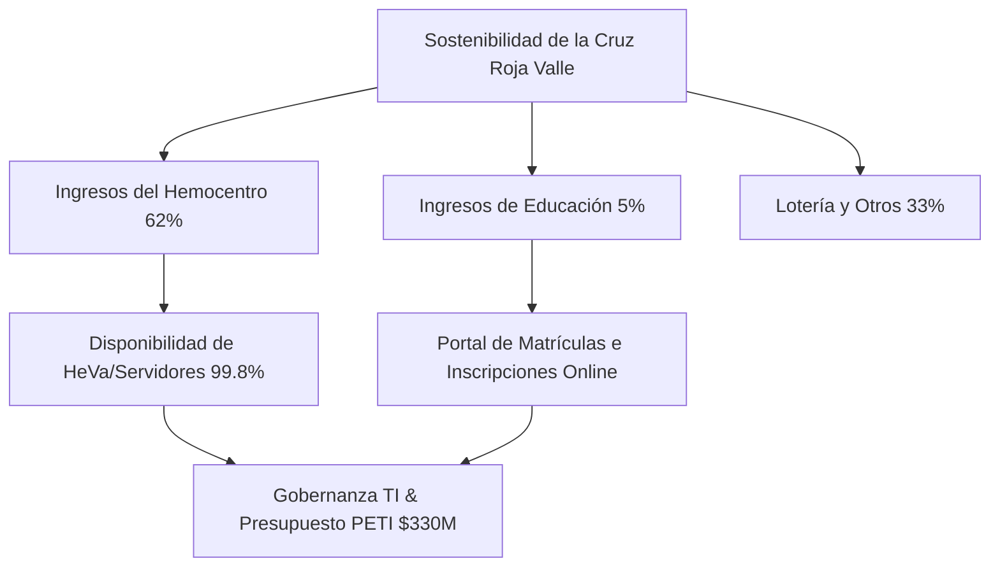

# 1. Introducción y Contexto Estratégico (PETI 2026-2030)

En las organizaciones del tercer sector, la tecnología suele percibirse erróneamente como un mero centro de costes o soporte operativo. Sin embargo, para la **Cruz Roja Colombiana - Seccional Valle del Cauca**, el periodo estratégico **2026-2030** marca un punto de inflexión fundamental: **la tecnología es ahora un habilitador directo de la supervivencia institucional y del impacto humanitario**.

Este capítulo detalla el marco del **PETI (Plan Estratégico de Tecnologías de la Información)** y cómo el **Dashboard Estratégico del CIO** actúa como el puente conductor entre la visión directiva y la ejecución operativa.

---

## 🎯 El Desafío CIO en la Cruz Roja Valle

El Director de TI (CIO) de la Seccional Valle se enfrenta a una doble responsabilidad:
1. **Mantener una disponibilidad crítica del 99.8%** en los servicios del **Hemocentro** (servidor local HeVa, bases de datos de donantes y despacho), donde una interrupción de 2 horas puede comprometer entregas urgentes de sangre y plaquetas a clínicas de la región, afectando directamente la vida de pacientes.
2. **Optimizar cada peso del presupuesto de TI** ($330M COP para el periodo), asegurando la rentabilidad social y mitigando riesgos legales y de ciberseguridad sin incurrir en costes recurrentes innecesarios de licenciamiento o infraestructura de difícil mantenimiento.

---

## 🏛️ Gobernanza TI bajo ISO/IEC 38500

Para evitar decisiones de inversión improvisadas, la seccional adoptó el estándar internacional de gobernanza de TI **ISO/IEC 38500**. Esta norma proporciona una estructura basada en tres pilares de acción directiva:

1. **Evaluar (Presente)**: Monitorear de forma constante el estado real de la infraestructura, la ciberseguridad, los procesos y el nivel de madurez digital.
2. **Dirigir (Futuro)**: Aprobar proyectos e iniciativas estratégicas del PETI con asignaciones de presupuesto claras que mitiguen de raíz las brechas detectadas.
3. **Monitorear (Continuo)**: Asegurar que los proyectos estratégicos generen el valor esperado, cumplan con los SLAs de continuidad y sigan el marco de conformidad legal.

El **Dashboard Estratégico CIO** es la representación digital de este ciclo continuo. Permite al CIO y a la junta directiva realizar simulaciones en tiempo real del impacto de sus aprobaciones, facilitando una gobernanza de TI transparente y proactiva.

---

## 📊 El PETI 2026-2030: Iniciativas y Presupuesto

El Plan Estratégico de TI se divide en 6 iniciativas clave con un presupuesto total consolidado de **$330M COP**:

| ID | Proyecto Estratégico | Presupuesto | Prioridad | Propósito del Proyecto |
| :--- | :--- | :--- | :--- | :--- |
| **B1** | Ciberseguridad / SOC Humanitario | $45M COP | Crítica | Nombrar un CISO, implementar MFA y activar un SOC para blindar el Hemocentro contra Ransomware e incidentes. |
| **B2** | Infraestructura Cloud Azure | $80M COP | Alta | Migrar los servidores físicos obsoletos (>5 años) a un entorno híbrido en la nube para garantizar DRP. |
| **B3** | API Gateway (HL7 / FHIR) | $55M COP | Media | Resolver los silos de información interconectando Siesa, HeVa y Q-Symphony para trazabilidad del hemocomponente. |
| **B4** | Analítica Institucional | $60M COP | Alta | Dashboards analíticos para control y auditoría de indicadores. |
| **B5** | Hemocentro 4.0 + Portal PSE | $75M COP | Crítica | Digitalizar el 90% de trámites de donantes y matrículas del Instituto para abrir mercados online y retener estudiantes. |
| **B8** | Capacitación y Apropiación | $15M COP | Media | Cerrar la brecha de apropiación digital en 300+ voluntarios y empleados para reducir el phishing y mejorar soporte. |

---

## 💡 Alineación de Sostenibilidad y Misión

El presupuesto anual del PETI está intrínsecamente ligado al éxito de las operaciones comerciales de la Cruz Roja Valle:

Una parada técnica prolongada en el Hemocentro no solo detiene la labor humanitaria, sino que también destruye la confianza B2B con clínicas y EPS del departamento, erosionando el 62% de la base de ingresos que financia el resto de las operaciones de rescate, atención prehospitalaria y voluntariado. El Dashboard del CIO garantiza que las decisiones estratégicas de TI salvaguarden la viabilidad general de la institución.
