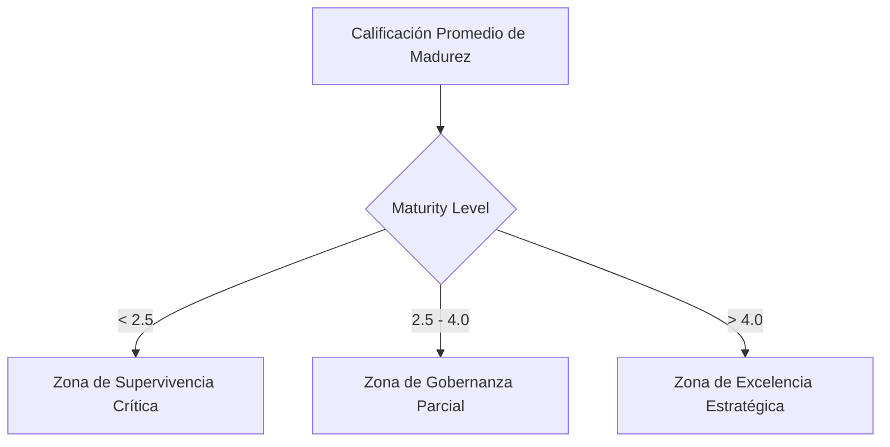

# 6. Motor de Prescripción y FODA

El valor diferencial del **Dashboard Estratégico CIO** de la Cruz Roja Valle no radica únicamente en visualizar datos estáticos, sino en su **capacidad prescriptiva**. Siguiendo el estándar de gobernanza **ISO/IEC 38500**, el sistema analiza automáticamente la causa-raíz de las debilidades operativas y prescribe cursos de acción concretos ordenados por prioridad de impacto estratégico (P1 e inmediatos vs. P2 y a largo plazo).

Este capítulo detalla la lógica de análisis del motor prescriptivo y la matriz FODA ponderada dinámica implementada.

***

## 🧠 ¿Qué es la Analítica Prescriptiva en Gobierno de TI?

En el contexto de la gobernanza, las analíticas se dividen en cuatro etapas de madurez:

```
  1. Descriptiva: ¿Qué pasó? (Métricas básicas de incidentes y costes en el pasado)
  2. Diagnóstica: ¿Por qué pasó? (Identificación de brechas de seguridad e infraestructura obsoleta)
  3. Predictiva: ¿Qué pasará? (Previsión de caídas del Hemocentro ante fallas del servidor local)
  4. Prescriptiva: ¿Qué debe hacer el CIO ahora? (Asignar presupuesto prioritario para resolver la brecha)
```

Nuestra plataforma implementa **Analítica Prescriptiva**. Conecta directamente los puntajes del autodiagnóstico con un motor de lógica estratégica en cliente que responde de forma inmediata: **"¿Qué decisiones ejecutivas debe tomar el CIO y en qué orden de prioridad para blindar la operación y la ciberseguridad?"**

***

## ⚡ Lógica de Acciones Prescriptivas Dinámicas

El motor divide las recomendaciones en dos niveles de urgencia estratégica según las decisiones y puntuaciones del autodiagnóstico:

### 1. Acciones Inmediatas – Fase P1 (Próximos 90 Días)

Estas iniciativas se enfocan en mitigar riesgos catastróficos que amenazan de forma directa la vida humana o la viabilidad jurídica de la Cruz Roja Valle:

<<<<<<< HEAD
* **Designar CISO y Activar el SOC Humanitario ($45M COP)**:  
  *Causa:* Si la ciberseguridad y conformidad tienen notas críticas ($\le 3.0$) y el proyecto CISO (B1) no ha sido aprobado.  
  *Prescripción:* Riesgo inminente de ransomware con impacto directo de hasta $771M COP en el Hemocentro. Designar CISO y activar monitoreo SOC es la prioridad absoluta de la seccional antes de cualquier otra digitalización.
* **Implementar Backups Inmutables en Azure ($80M COP)**:  
  *Causa:* Servidores físicos con más de 5 años y DRP no probado.  
  *Prescripción:* Un fallo físico de hardware en Cali paralizará la distribución de hemocomponentes. Se debe activar la retención inmutable a 90 días en la nube híbrida de Azure de forma urgente (plazo de implementación: 4 a 6 semanas).
* **Establecer el Gobierno de Datos Institucional ($12M COP)**:  
  *Causa:* Nivel de interoperabilidad deficiente en HeVa - Siesa 8.5.  
  *Prescripción:* Sin un gobierno de datos formal (DAMA-DMBOK2) no hay analítica confiable ni cumplimiento de la Ley 1581 (MSPI). Debe iniciarse en Q1 2026.
* **Gobernanza del Sistema Predictivo HemoAI Analytics (ISO 42001)**:  
  *Causa:* Ejecución de modelos de Machine Learning en el Hemocentro sin controles formalizados de sesgo ni interpretabilidad (SHAP/LIME).  
  *Prescripción:* El Comité de IA debe estructurar el Sistema de Gestión (SGAI) bajo la norma ISO 42001:2023, activando Fairlearn para auditar la equidad del modelo de priorización y evitar el desvío de datos (Drift PSI).

=======
* **Designar CISO y Activar el SOC Humanitario ($45M COP)**:\
  &#xNAN;_&#x43;ausa:_ Si la ciberseguridad y conformidad tienen notas críticas ($\le 3.0$) y el proyecto CISO (B1) no ha sido aprobado.\
  &#xNAN;_&#x50;rescripción:_ Riesgo inminente de ransomware con impacto directo de hasta $771M COP en el Hemocentro. Designar CISO y activar monitoreo SOC es la prioridad absoluta de la seccional antes de cualquier otra digitalización.
* **Implementar Backups Inmutables en Azure ($80M COP)**:\
  &#xNAN;_&#x43;ausa:_ Servidores físicos con más de 5 años y DRP no probado.\
  &#xNAN;_&#x50;rescripción:_ Un fallo físico de hardware en Cali paralizará la distribución de hemocomponentes. Se debe activar la retención inmutable a 90 días en la nube híbrida de Azure de forma urgente (plazo de implementación: 4 a 6 semanas).
* **Establecer el Gobierno de Datos Institucional ($12M COP)**:\
  &#xNAN;_&#x43;ausa:_ Nivel de interoperabilidad deficiente.\
  &#xNAN;_&#x50;rescripción:_ Sin un gobierno de datos formal no hay analítica posible ni cumplimiento de la Ley 1581 (MSPI). Debe iniciarse en Q1 2026.
>>>>>>> 70c6d89b04e02049bc7772d0a3d9c010f09b835c

***

### 2. Acciones Estratégicas – Fase P2 (Mediano Plazo - 2027)

Iniciativas orientadas a mejorar la eficiencia de costes, capturar nuevas oportunidades de ingresos y consolidar la transformación digital del talento humano:

* **Implementar API Gateway FHIR/HL7 ($55M COP)**:\
  &#xNAN;_&#x43;ausa:_ Siesa, HeVa y Q-Symphony operando como silos de datos aislados.\
  &#xNAN;_&#x50;rescripción:_ Interconectar sistemas críticos bajo estándares de salud internacionales para habilitar la trazabilidad total del hemocomponente B2B con clínicas aliadas.
* **Portal Transaccional PSE y App Hemocentro 4.0 ($75M COP)**:\
  &#xNAN;_&#x43;ausa:_ Canal de donantes manual o portal del Instituto inactivo.\
  &#xNAN;_&#x50;rescripción:_ Lanzar pasarelas de pago y agendamiento 100% online para capturar mercado corporativo y retener estudiantes frente a EdTech sustitutas gratuitas.
* **Cerrar Brecha Digital en Voluntarios vía Teams ($15M COP)**:\
  &#xNAN;_&#x43;ausa:_ Resistencia al cambio y baja apropiación digital del personal de campo.\
  &#xNAN;_&#x50;rescripción:_ Iniciar microaprendizaje móvil utilizando los smartphones del personal. Eleva la madurez de apropiación de 2.8 a 4.2 y mitiga el riesgo de phishing.

***

## 📊 Matriz FODA Dinámica Ponderada

El motor clasifica el estado estratégico de la Cruz Roja Valle en una matriz FODA dinámica según la puntuación de Madurez Digital Promedio:



### 🚨 Zona de Supervivencia Crítica (Madurez < 2.5)

* **Diagnóstico:** Los factores internos se encuentran en un nivel alarmante. La Cruz Roja Valle está expuesta a ciberataques inminentes y caídas físicas que paralizarían el Hemocentro.
* **Prescripción:** Ciberseguridad (CISO/SOC) y resiliencia en la nube deben ser prioritarias de inmediato. Detener temporalmente proyectos de innovación digital no esenciales.

### ⚠️ Zona de Gobernanza Parcial (Madurez 2.5 - 4.0)

* **Diagnóstico:** Se ha mejorado la resiliencia y mitigado riesgos críticos. No obstante, las debilidades de integración (matrículas del Instituto y App) limitan la captación de valor del entorno.
* **Prescripción:** Completar la interoperabilidad HL7/FHIR y canales transaccionales para optimizar ingresos.

### ✅ Zona de Excelencia Estratégica (Madurez > 4.0)

* **Diagnóstico:** Posicionamiento sólido en el cuadrante de crecimiento. La Cruz Roja posee una gobernanza segura, infraestructura escalable y procesos de capacitación continuos.
* **Prescripción:** Continuar con auditorías periódicas de seguridad y monitorear SLAs operativos de forma automatizada.
